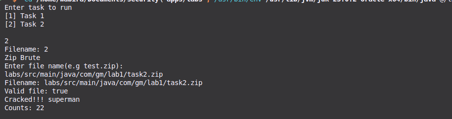

# Lab 1: Java Basic Classes and Features

## Objective

To explore fundamental Java concepts, including the creation and utilization of basic classes, object-oriented principles, and exception handling.

---

## Task 1: Calculate Math Expressions

### Objective

Develop a console-based program that reads mathematical expressions from a file, evaluates them, and saves the results.

### 1.1 Create a `math.txt` File

To create a file containing mathematical expressions, run the following command in your terminal:

```bash
echo -e "1+1\n2*2\n16*74\n100*100" > labs/src/main/java/com/gm/lab1/math.txt
```

### 1.2 Run the Program

Compile and run the main program. Select option 1 to execute Task 1.


### 1.3 View Results

The results of the calculations will be saved in the file located at `labs/src/main/java/com/gm/lab1/calculations.txt`.


---

## Task 2: Crack a Zip Archive

### Objective

Create a console-based Java program that attempts to crack a local ZIP file created by the user. The program will utilize a dictionary attack using common passwords sourced from GitHub.

### 2.1 Download Common Passwords

First, download a list of common passwords from GitHub's [10k-most-common passwords](https://raw.githubusercontent.com/danielmiessler/SecLists/refs/heads/master/Passwords/Common-Credentials/10k-most-common.txt).


### 2.2 Create a Password-Protected ZIP File

Use the following command to create a password-protected ZIP file containing your README file:

```bash
zip -e labs/src/main/java/com/gm/lab1/task2.zip labs/src/main/java/com/gm/lab1/Readme.md
```

You will be prompted to enter a password. Use one of the passwords from the previous step.


### 2.3 Run the Brute Force Program

Execute your brute force program. If successful, the cracked password will be displayed in the console and saved to `labs/src/main/java/com/gm/lab1/password.txt`.



---

## Conclusion

In this lab, you have learned how to create and manipulate basic Java classes, handle exceptions, and implement a simple brute force password cracking technique. These skills are foundational for further exploration of Java and software development.

---
