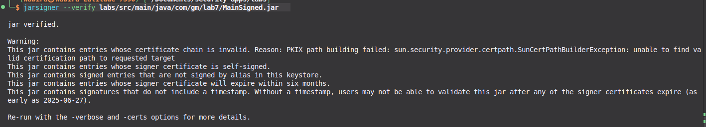

# Lab 8: Java File Signature Verification

## Objective

To gain an understanding of the security organization in the Java platform by verifying the signatures of JAR files.

## Tasks

1. Explore the material related to Java security and JAR file signing.
2. Verify the signature of the JAR file created in the previous laboratory.

## 1. Verify Unsigned JAR

To verify an unsigned JAR file, use the following command:

```bash
jarsigner --verify labs/src/main/java/com/gm/lab7/Main.jar
```


## 2. Verify Signed JAR

To verify a signed JAR file, use the following command:

```bash
jarsigner --verify labs/src/main/java/com/gm/lab7/MainSigned.jar
```


