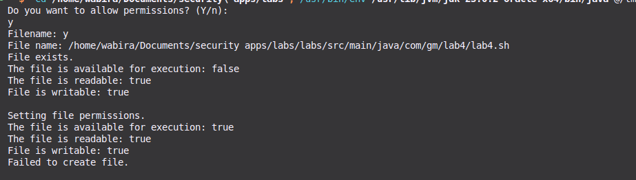
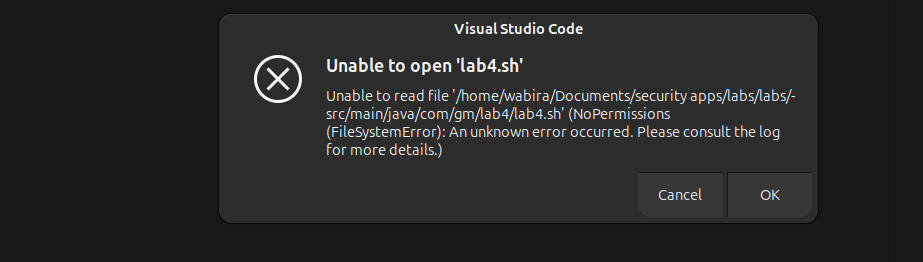

# Lab 4: Using a File Access Policy

## Objective

To understand the organization of protection in the Java platform through file access rights.

---

### Task Overview

In this lab, you will create a shell script and manipulate its file permissions using a Java program. You will learn how to set and restrict access rights, and observe the effects of these changes.

### 1. Create an Executable File `lab4.sh`

First, create a shell script named `lab4.sh` if it does not already exist. Use the following command in your terminal:

```bash
echo 'whoami' > labs/src/main/java/com/gm/lab4/lab4.sh
```

### 2. Run the Program and Allow All Permissions

Execute the Java program that manages file permissions. When prompted, choose to allow all permissions by entering `y`. After this step, the `lab4.sh` file should be readable, writable, and executable.



### 3. Run the Program Again and Deny Permissions

Run the program once more, but this time enter `n` when prompted to set permissions to `false`. After this action, the `lab4.sh` file should no longer be readable, writable, or executable. Attempting to access the file should result in an error.



---

## Conclusion

In this lab, you have learned how to create a shell script and manipulate its file access permissions using a Java program. Understanding file access policies is crucial for ensuring the security and integrity of applications in the Java platform.
