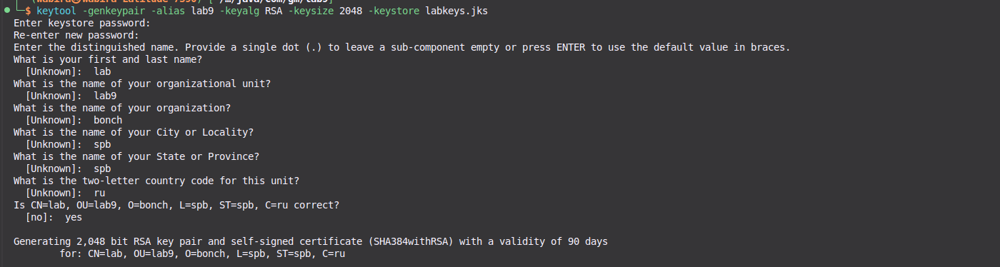
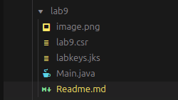
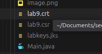
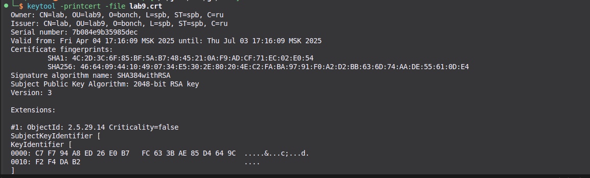

# Lab 9 Request for a certificate

**Objective**: The objective of this lab is to learn how to implement a certificate request in Java, which is essential for establishing secure communications over the internet using HTTPS (HTTP over TLS).

**Overview**: In this lab, you will go through the process of generating a key pair, creating a Certificate Signing Request (CSR), exporting a self-signed certificate, importing a signed certificate (or root/intermediate certificate), and viewing certificate information using the `keytool` utility provided by the Java Development Kit (JDK). This hands-on experience will help you understand the steps involved in managing SSL/TLS certificates, which are crucial for securing web applications and services.

**Tasks**:

1. Generate a key pair.
2. Generate a request for an existing private key.
3. Export the self-signed certificate.
4. Import a signed/root/intermediate certificate.
5. Use `keytool` to view certificate information.

## Work

### 1. Generate a Key Pair

Generate a key pair using the following command:

```bash
keytool -genkeypair -alias lab9 -keyalg RSA -keysize 2048 -keystore labkeys.jks
```

This command creates a new key pair (public and private key) and stores it in a keystore file named `labkeys.jks`.



---

### 2. Generating a Request for an Existing Private Key

To create a Certificate Signing Request (CSR) for the existing private key, use the following command:

```bash
keytool -certreq -alias lab9 -file lab9.csr -keystore labkeys.jks
```

This command generates a CSR that can be sent to a Certificate Authority (CA) to obtain a signed certificate.



---

### 3. Export the Self-Signed Certificate

To export the self-signed certificate from the keystore, use the following command:

```bash
keytool -exportcert -alias lab9 -keystore labkeys.jks -file lab9.crt
```

This command exports the self-signed certificate associated with the specified alias to a `.crt` file.



---

### 4. Importing Signed/Root/Intermediate Certificate

To import a signed certificate (or a root/intermediate certificate) into the keystore, use the following command:

```bash
keytool -importcert -trustcacerts -file lab9.crt -alias lab9_imported -keystore labkeys.jks
```

This command imports a certificate into the keystore. It must match the private key associated with the specified alias.


---

### 5. Using Keytool to View Certificate Information

To view detailed information about the exported certificate, use the following command:

```bash
keytool -printcert -file lab9.crt
```

This command displays detailed information about the specified certificate, including its validity, owner, and issuer.



---

### Summary

These steps outline the process of generating a key pair, creating a CSR, exporting a self-signed certificate, importing it into a keystore, and viewing certificate information using the `keytool` utility. This process is essential for implementing secure communications using SSL/TLS in Java applications.
